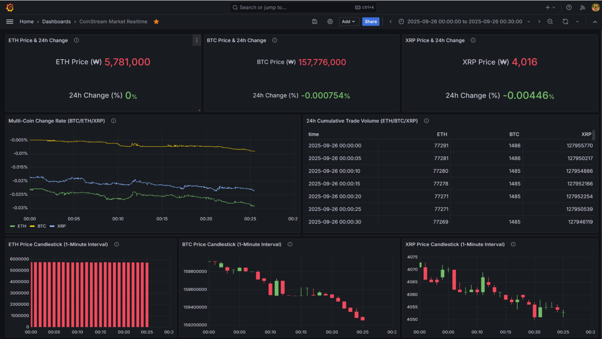

# ⚡️CoinStream: 실시간 코인 데이터 스트리밍 & 대시보드 

**Upbit WebSocket API**를 통해 코인 시세 데이터를 실시간으로 수집하고, **Kafka → Spark Streaming → Redis/S3** 파이프라인을 구축하여 **Grafana** 대시보드로 시각화 및 모니터링을 구현한 프로젝트입니다.

## 프로젝트 개요
- 진행 기간 : 2025.08.25 ~ 현재 (진행 중)
- 프로젝트 형태 : 개인 프로젝트 (단독 수행)

### 프로젝트 목표
- 웹소켓 API 기반 실시간 데이터 수집 및 처리
- 데이터 파이프라인 자동화 및 시스템 모니터링 체계 구축
- 실시간 조회 + 장기 저장 구조를 통한 데이터 활용성 극대화

## 기술 스택
- 데이터 수집 : Upbit WebSocket API

- 메시징/스트리밍 : Apache Kafka

- 실시간 처리 : Apache Spark Streaming

- 저장소 : Redis (실시간 조회), AWS S3 (장기 저장)

- 시각화 : Grafana

- 워크플로우 자동화 : Apache Airflow (Kafka → Spark → S3 DAG)

- 모니터링 : Prometheus + Grafana
  
- 환경 구성 : Docker 기반 컨테이너 환경 (Zookeeper, Kafka, Spark, Airflow, Redis, Prometheus, Grafana)

- 클라우드 인프라 : AWS EC2

## 시스템 아키텍처

## 주요 기능
- 실시간 데이터 수집 : WebSocket 기반 코인 시세·거래량 데이터 수집

- 메시징 처리 : Kafka 토픽으로 데이터 스트리밍 전달

- 실시간 집계 : Spark Streaming으로 평균가, 변동률, 거래량 Top N 집계

- 데이터 저장 : Redis(실시간 조회), AWS S3(장기 보관/분석용)

- 대시보드 시각화 : Grafana에서 실시간 지표 및 캔들차트 시각화

- 자동화 워크플로우 : Airflow DAG을 통한 ETL 파이프라인 자동화

- 시스템 모니터링 : Prometheus 메트릭 수집 → Grafana 대시보드 모니터링

## 대시보드 화면

### 실시간 데이터 대시보드

### 시스템 모니터링 대시보드

