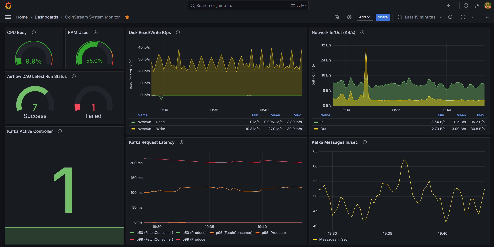
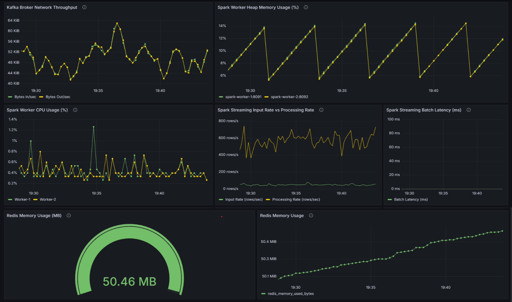

# ⚡️CoinStream: 실시간 코인 데이터 스트리밍 & 대시보드 

**Upbit WebSocket API**를 통해 코인 시세 데이터를 실시간으로 수집하고, **Kafka → Spark Streaming → Redis/S3** 파이프라인을 구축하여 **Grafana** 대시보드로 시각화 및 모니터링을 구현한 프로젝트입니다.

## 프로젝트 개요
- 진행 기간 : 2025.08.25 ~ 2025.10.03
- 프로젝트 형태 : 개인 프로젝트 (단독 수행)

### 프로젝트 목표

- 웹소켓 기반 실시간 코인 데이터 스트리밍 파이프라인 구축 경험 확보
- Kafka–Spark–Redis/S3를 연계한 데이터 파이프라인 설계 및 운영 자동화
- Docker·Prometheus·Grafana를 활용한 통합 모니터링 및 인프라 환경 구성
## 기술 스택

- **데이터 수집:** Upbit WebSocket API
- **메시징/스트리밍:** Apache Kafka
- **실시간 처리:** Apache Spark Streaming
- **데이터 저장소:** Redis (실시간 조회), AWS S3 (장기 저장)
- **대시보드 시각화:** Grafana
- **배치 파이프라인 관리:** Apache Airflow (Spark → S3)
- **모니터링:** Prometheus
- **환경 구성:** Docker compose
- **인프라:** AWS EC2

## 시스템 아키텍처

## 주요 기능

- **실시간 데이터 수집**: Upbit WebSocket API를 통해 코인 시세, 거래량 데이터 스트리밍 수집
- **메시징 처리**: Kafka 토픽 기반으로 데이터 스트리밍 전달
- **실시간 처리 및 적재**: Spark Streaming으로 실시간 데이터 처리 후 Redis에 적재
- **데이터 저장**: Redis(실시간 조회 캐시), AWS S3(장기 저장 및 분석용)
- **대시보드 시각화**:
    - *Realtime Market Dashboard* — Grafana에서 실시간 시세, 거래량, 변동률, Top N 코인 시각화
    - *System Monitoring Dashboard* — Kafka·Spark·Redis·Airflow·EC2 자원 상태 모니터링
- **배치 파이프라 관리**: Airflow로 Spark → S3 데이터 적재 파이프라인 실행 및 스케줄링
- **모니터링**: Prometheus로 시스템 및 파이프라인 메트릭 수집 후 Grafana와 연동
- **환경 구성**: Docker Compose 기반으로 Kafka, Spark, Redis, Prometheus, Grafana 등 컨테이너 통합 환경 구성

## 대시보드 화면

실시간 데이터 분석과 시스템 상태를 Grafana를 통해 시각화했습니다.

### 실시간 데이터 대시보드

_Grafana 실시간 코인 시세 변화 및 거래량 모니터링_

- 멀티코인 변화율 라인차트 (BTC, ETH, XRP)
- 24시간 누적 거래량 비교
- 코인별 1분 캔들차트
- 단일 코인 지표 카드
- 24시간 기준 Top 3 (거래대금 / 거래량 / 상승률)

### 시스템 모니터링 대시보드

_Kafka, Spark, Redis, EC2 자원 상태 실시간 모니터링_

- Airflow DAG 실행 성공/실패 현황
- Kafka 브로커 Throughput 및 Latency
- Spark Worker CPU/Memory 사용량
- Spark Streaming 처리 속도 및 배치 지연
- Redis 메모리 사용량
- EC2 서버 자원 상태 모니터링

